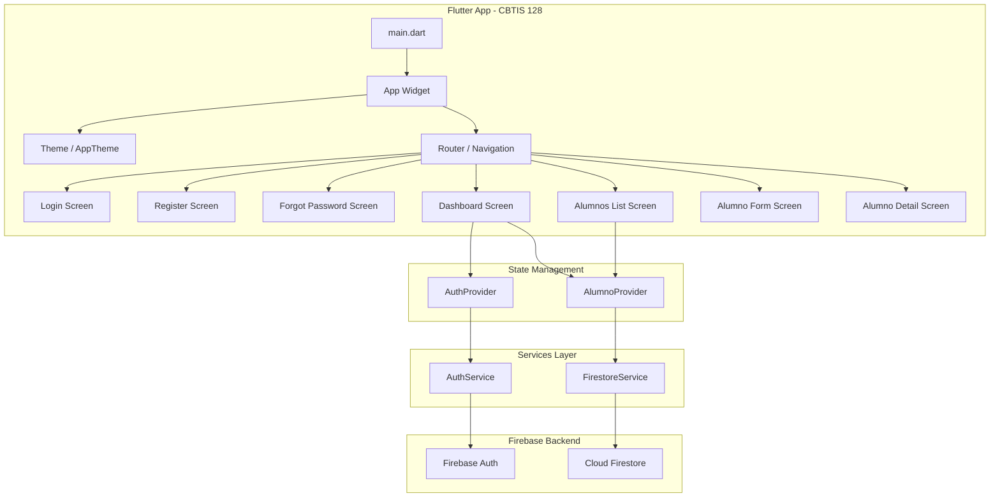
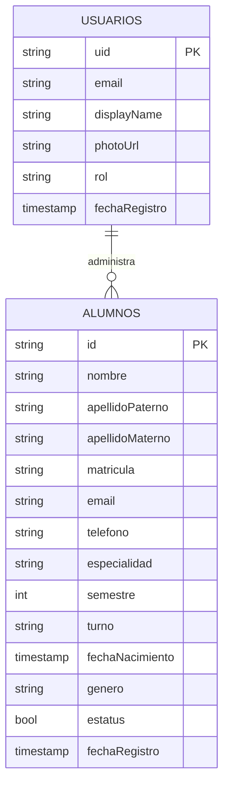
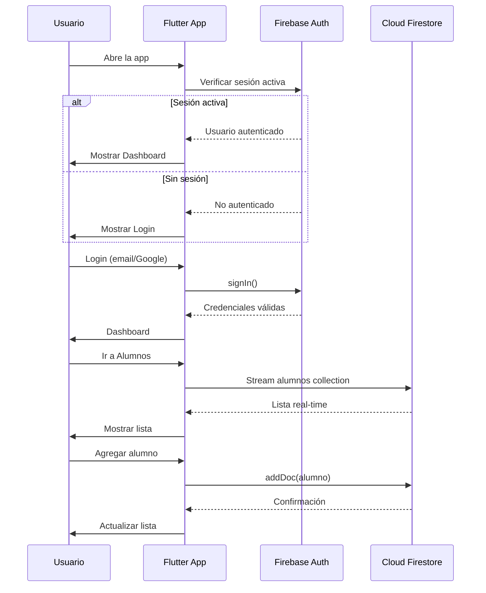

# Centro de Control Escolar - Plantel CBTIS 128

Aplicación Flutter multiplataforma (Android/Web/Windows) para administrar un control escolar completo, integrada con Firebase Console (proyecto `controlescolarcbtis128`).

## Entorno Detectado

| Herramienta | Versión |
|---|---|
| Flutter | 3.41.6 (stable) |
| Dart | 3.11.4 |
| Firebase CLI | 15.15.0 |
| FlutterFire CLI | 1.3.2 |
| Workspace | `c:\antigravityproyecto\navacontroescolar` (vacío) |

---

## User Review Required

> [!IMPORTANT]
> **Proyecto Firebase Console**: El plan asume que ya existe el proyecto `controlescolarcbtis128` en Firebase Console con **Authentication** (Email/Password + Google) y **Cloud Firestore** habilitados. Si no existe, se deberá crear manualmente antes de ejecutar `flutterfire configure`.

> [!WARNING]
> **Google Sign-In en Android**: Requiere configurar el SHA-1 del certificado de depuración en la consola de Firebase. Se proporcionará el comando para obtenerlo durante la ejecución.

> [!IMPORTANT]
> **Plataformas**: Se habilitarán Android, Web y Windows. iOS/macOS no están incluidos salvo indicación contraria.

---

## Open Questions

1. **¿Ya existe el proyecto `controlescolarcbtis128` en Firebase Console?** Si no, necesitaremos crearlo antes de la configuración.
2. **¿Qué campos debe tener la entidad Alumno?** El plan propone: nombre, apellidoPaterno, apellidoMaterno, matricula, email, telefono, especialidad, semestre, turno, fechaNacimiento, genero, estatus (activo/inactivo), fechaRegistro. ¿Se requieren campos adicionales?
3. **¿El Dashboard debe mostrar datos reales de todas las entidades (profesores, materias, calificaciones) o por ahora solo Alumnos con widgets placeholder para las demás?** El plan implementa el CRUD completo de Alumnos y dashboard con tarjetas informativas para las demás entidades.

---

## Arquitectura General



---

## Estructura de Carpetas del Proyecto

```
navacontroescolar/
├── lib/
│   ├── main.dart                          # Entry point + Firebase init
│   ├── app.dart                           # MaterialApp + routing
│   │
│   ├── config/
│   │   └── firebase_options.dart          # Generado por FlutterFire CLI
│   │
│   ├── models/
│   │   ├── usuario_model.dart             # Modelo Usuario
│   │   └── alumno_model.dart              # Modelo Alumno
│   │
│   ├── services/
│   │   ├── auth_service.dart              # Firebase Auth (login, register, Google, reset)
│   │   └── firestore_service.dart         # Firestore CRUD genérico + alumnos
│   │
│   ├── providers/
│   │   ├── auth_provider.dart             # Estado de autenticación
│   │   └── alumno_provider.dart           # Estado CRUD alumnos
│   │
│   ├── screens/
│   │   ├── auth/
│   │   │   ├── login_screen.dart          # Inicio de sesión
│   │   │   ├── register_screen.dart       # Registro
│   │   │   └── forgot_password_screen.dart # Recuperar contraseña
│   │   ├── dashboard/
│   │   │   └── dashboard_screen.dart      # Panel principal
│   │   └── alumnos/
│   │       ├── alumnos_list_screen.dart   # Lista de alumnos
│   │       ├── alumno_form_screen.dart    # Agregar/Editar alumno
│   │       └── alumno_detail_screen.dart  # Detalle del alumno
│   │
│   ├── widgets/
│   │   ├── custom_text_field.dart         # TextField estilizado
│   │   ├── custom_button.dart             # Botón principal
│   │   ├── google_sign_in_button.dart     # Botón Google
│   │   ├── dashboard_card.dart            # Tarjeta del dashboard
│   │   ├── alumno_card.dart               # Tarjeta de alumno en lista
│   │   ├── loading_indicator.dart         # Indicador de carga
│   │   ├── sidebar_menu.dart              # Menú lateral (drawer/sidebar)
│   │   └── empty_state_widget.dart        # Widget estado vacío
│   │
│   └── themes/
│       └── app_theme.dart                 # Tema global (colores, tipografía, componentes)
│
├── android/                               # Configuración Android
├── web/                                   # Configuración Web
├── windows/                               # Configuración Windows
├── pubspec.yaml                           # Dependencias
└── firebase.json                          # Config Firebase (generado)
```

---

## Proposed Changes

### Fase 1: Inicialización del Proyecto Flutter

#### [NEW] Proyecto Flutter
- Crear proyecto Flutter en el directorio actual con soporte para Android, Web y Windows
- Comando: `flutter create --project-name nava_control_escolar --org com.cbtis128 --platforms android,web,windows .`

---

### Fase 2: Dependencias (`pubspec.yaml`)

#### [MODIFY] [pubspec.yaml](file:///c:/antigravityproyecto/navacontroescolar/pubspec.yaml)

Agregar las siguientes dependencias:

```yaml
dependencies:
  flutter:
    sdk: flutter
  
  # Firebase Core
  firebase_core: ^3.13.0
  
  # Autenticación
  firebase_auth: ^5.7.0
  google_sign_in: ^6.3.0
  
  # Base de datos
  cloud_firestore: ^5.12.0
  
  # State Management
  provider: ^6.1.5
  
  # UI/UX
  google_fonts: ^6.2.1
  animations: ^2.0.12
  font_awesome_flutter: ^10.9.0
  
  # Utilidades
  intl: ^0.20.2
  fluttertoast: ^8.2.12
  cached_network_image: ^3.4.1
```

---

### Fase 3: Configuración Firebase

#### [NEW] firebase_options.dart (generado)
- Ejecutar: `flutterfire configure --project=controlescolarcbtis128`
- Esto genera `lib/config/firebase_options.dart` automáticamente
- Configura Android (`google-services.json`), Web y Windows

---

### Fase 4: Tema y Diseño (`themes/`)

#### [NEW] [app_theme.dart](file:///c:/antigravityproyecto/navacontroescolar/lib/themes/app_theme.dart)

Paleta de colores premium para institución educativa:

| Elemento | Color | Uso |
|---|---|---|
| Primary | `#1A237E` (Indigo 900) | Barras, botones principales |
| Primary Variant | `#283593` (Indigo 800) | Hover, estados activos |
| Secondary | `#00BFA5` (Teal Accent) | Acentos, FABs, badges |
| Surface | `#F5F7FA` | Fondos de cards |
| Background | `#FAFBFD` | Fondo general |
| Error | `#EF5350` | Errores, eliminación |
| Success | `#66BB6A` | Éxito, activos |
| Warning | `#FFA726` | Advertencias |
| Card Gradient | Indigo 900 → Indigo 700 | Headers de cards |
| Sidebar | `#0D1B3E` (Dark Navy) | Menú lateral |

- Tipografía: **Google Fonts Outfit** (headings) + **Inter** (body)
- Bordes redondeados: 16px para cards, 12px para inputs
- Sombras suaves con `BoxShadow` personalizadas
- Modo claro (con posibilidad de dark mode futuro)

---

### Fase 5: Modelos de Entidades (`models/`)

#### [NEW] [usuario_model.dart](file:///c:/antigravityproyecto/navacontroescolar/lib/models/usuario_model.dart)

```dart
class Usuario {
  final String uid;
  final String email;
  final String? displayName;
  final String? photoUrl;
  final String rol; // 'admin', 'docente', 'alumno'
  final DateTime? fechaRegistro;
}
```

#### [NEW] [alumno_model.dart](file:///c:/antigravityproyecto/navacontroescolar/lib/models/alumno_model.dart)

```dart
class Alumno {
  final String? id;                // Firestore document ID
  final String nombre;
  final String apellidoPaterno;
  final String apellidoMaterno;
  final String matricula;
  final String email;
  final String telefono;
  final String especialidad;       // 'Programación', 'Contabilidad', etc.
  final int semestre;              // 1-6
  final String turno;             // 'Matutino', 'Vespertino'
  final DateTime fechaNacimiento;
  final String genero;            // 'Masculino', 'Femenino', 'Otro'
  final bool estatus;             // true=activo, false=inactivo
  final DateTime fechaRegistro;
  
  // Métodos: toMap(), fromMap(), copyWith()
}
```

**Colección Firestore**: `alumnos` (como indicado por el usuario)

---

### Fase 6: Servicios (`services/`)

#### [NEW] [auth_service.dart](file:///c:/antigravityproyecto/navacontroescolar/lib/services/auth_service.dart)

Métodos:
- `signInWithEmail(email, password)` → Login con email/contraseña
- `registerWithEmail(email, password, displayName)` → Registro
- `signInWithGoogle()` → Login con Google
- `resetPassword(email)` → Enviar email de restablecimiento
- `signOut()` → Cerrar sesión
- `getCurrentUser()` → Usuario actual
- `authStateChanges` → Stream de cambios de autenticación

#### [NEW] [firestore_service.dart](file:///c:/antigravityproyecto/navacontroescolar/lib/services/firestore_service.dart)

Métodos para colección `alumnos`:
- `addAlumno(Alumno)` → Crear documento
- `getAlumnos()` → Stream de lista de alumnos (real-time)
- `getAlumnoById(id)` → Obtener alumno por ID
- `updateAlumno(id, Alumno)` → Actualizar documento
- `deleteAlumno(id)` → Eliminar documento
- `searchAlumnos(query)` → Buscar por nombre/matrícula

---

### Fase 7: Providers (`providers/`)

#### [NEW] [auth_provider.dart](file:///c:/antigravityproyecto/navacontroescolar/lib/providers/auth_provider.dart)

- Gestión del estado de autenticación
- Expone: `isLoading`, `user`, `errorMessage`
- Métodos delegados a `AuthService`

#### [NEW] [alumno_provider.dart](file:///c:/antigravityproyecto/navacontroescolar/lib/providers/alumno_provider.dart)

- Gestión del estado CRUD de alumnos
- Expone: `alumnos`, `isLoading`, `selectedAlumno`
- Métodos delegados a `FirestoreService`
- Filtros por especialidad, semestre, estatus

---

### Fase 8: Pantallas de Autenticación (`screens/auth/`)

#### [NEW] [login_screen.dart](file:///c:/antigravityproyecto/navacontroescolar/lib/screens/auth/login_screen.dart)

Diseño premium con:
- Logo/escudo CBTIS 128 (generado con texto estilizado)
- Campos: Email, Contraseña (con toggle de visibilidad)
- Botón "Iniciar Sesión" (gradiente primary)
- Botón "Continuar con Google" (estilo oficial)
- Links: "¿Olvidaste tu contraseña?" y "Registrarse"
- Animaciones de entrada con `FadeTransition` + `SlideTransition`
- Fondo con gradiente sutil

#### [NEW] [register_screen.dart](file:///c:/antigravityproyecto/navacontroescolar/lib/screens/auth/register_screen.dart)

- Campos: Nombre completo, Email, Contraseña, Confirmar contraseña
- Validaciones en tiempo real
- Botón de registro
- Opción "¿Ya tienes cuenta? Inicia sesión"

#### [NEW] [forgot_password_screen.dart](file:///c:/antigravityproyecto/navacontroescolar/lib/screens/auth/forgot_password_screen.dart)

- Campo de email
- Botón "Enviar enlace de recuperación"
- Confirmación visual de envío exitoso

---

### Fase 9: Dashboard (`screens/dashboard/`)

#### [NEW] [dashboard_screen.dart](file:///c:/antigravityproyecto/navacontroescolar/lib/screens/dashboard/dashboard_screen.dart)

Layout responsivo con **Sidebar** (desktop/tablet) y **Drawer** (mobile):

```
┌──────────────────────────────────────────────────┐
│  CBTIS 128 - Control Escolar          [User] [⚙] │
├────────┬─────────────────────────────────────────┤
│        │                                         │
│  📊    │  ┌─────────┐ ┌─────────┐ ┌─────────┐   │
│ Inicio │  │ Alumnos │ │Profesores│ │Materias │   │
│        │  │   245   │ │   32    │ │   48    │   │
│  👨‍🎓   │  └─────────┘ └─────────┘ └─────────┘   │
│ Alumnos│                                         │
│        │  ┌─────────┐ ┌─────────┐ ┌─────────┐   │
│  👨‍🏫   │  │Especial.│ │Calific. │ │Semestres│   │
│ Profes.│  │    6    │ │  1,200  │ │  1 - 6  │   │
│        │  └─────────┘ └─────────┘ └─────────┘   │
│  📚    │                                         │
│ Materias│  ┌────────────────────────────────┐     │
│        │  │ Últimos Alumnos Registrados     │     │
│  🎯    │  │ • Juan Pérez - Programación    │     │
│ Espec. │  │ • María López - Contabilidad   │     │
│        │  │ • Carlos Ruiz - Mecatrónica    │     │
│  📝    │  └────────────────────────────────┘     │
│ Calif. │                                         │
│        │                                         │
│  🚪    │                                         │
│ Salir  │                                         │
└────────┴─────────────────────────────────────────┘
```

Tarjetas del dashboard con:
- Icono FontAwesome
- Contador animado
- Gradiente de color único por entidad
- Efecto hover (escala + sombra)
- Navegación al módulo correspondiente

---

### Fase 10: CRUD de Alumnos (`screens/alumnos/`)

#### [NEW] [alumnos_list_screen.dart](file:///c:/antigravityproyecto/navacontroescolar/lib/screens/alumnos/alumnos_list_screen.dart)

- **AppBar** con título y botón de búsqueda
- **Barra de filtros**: por especialidad, semestre, estatus
- **Lista de alumnos** en Cards con:
  - Avatar con inicial del nombre (color por especialidad)
  - Nombre completo, matrícula, especialidad, semestre
  - Badge de estatus (activo/inactivo)
  - Botones: **Ver** 👁️, **Editar** ✏️, **Eliminar** 🗑️
- **FAB** para agregar nuevo alumno
- **Estado vacío** cuando no hay registros
- **Datos en tiempo real** via StreamBuilder

#### [NEW] [alumno_form_screen.dart](file:///c:/antigravityproyecto/navacontroescolar/lib/screens/alumnos/alumno_form_screen.dart)

Formulario para Agregar/Editar alumno:
- Campos agrupados en secciones con headers
- **Datos Personales**: nombre, apellidos, fecha nacimiento, género
- **Datos Escolares**: matrícula, especialidad (dropdown), semestre (dropdown 1-6), turno
- **Contacto**: email, teléfono
- **Estatus**: switch activo/inactivo
- Validaciones en cada campo
- Botones: Guardar (primary), Cancelar
- Modo edición: pre-llena los datos del alumno

#### [NEW] [alumno_detail_screen.dart](file:///c:/antigravityproyecto/navacontroescolar/lib/screens/alumnos/alumno_detail_screen.dart)

- Vista detallada del alumno con toda su información
- Secciones visuales con iconos
- Botones de acción: Editar, Eliminar
- Diálogo de confirmación para eliminación

---

### Fase 11: Widgets Reutilizables (`widgets/`)

#### [NEW] Widgets personalizados

| Widget | Descripción |
|---|---|
| `custom_text_field.dart` | TextField con estilo premium, icono, validación visual |
| `custom_button.dart` | Botón con gradiente, loading state, animación |
| `google_sign_in_button.dart` | Botón oficial de Google con logo |
| `dashboard_card.dart` | Tarjeta de estadísticas con icono, contador, gradiente |
| `alumno_card.dart` | Card de alumno para la lista |
| `loading_indicator.dart` | CircularProgressIndicator estilizado |
| `sidebar_menu.dart` | Menú lateral responsivo con animaciones |
| `empty_state_widget.dart` | Ilustración + texto cuando no hay datos |

---

### Fase 12: Entry Points

#### [NEW] [main.dart](file:///c:/antigravityproyecto/navacontroescolar/lib/main.dart)

- Inicialización de `WidgetsFlutterBinding`
- `Firebase.initializeApp()` con `DefaultFirebaseOptions`
- `runApp()` con `MultiProvider` envolviendo la app

#### [NEW] [app.dart](file:///c:/antigravityproyecto/navacontroescolar/lib/app.dart)

- `MaterialApp` con tema personalizado
- Rutas nombradas para navegación
- `AuthWrapper` que decide si mostrar Login o Dashboard según estado de auth

---

## Colecciones Firestore



**Reglas de seguridad Firestore** (sugeridas):
```
rules_version = '2';
service cloud.firestore {
  match /databases/{database}/documents {
    match /alumnos/{alumnoId} {
      allow read, write: if request.auth != null;
    }
    match /usuarios/{userId} {
      allow read, write: if request.auth != null && request.auth.uid == userId;
    }
  }
}
```

---

## Flujo de Ejecución



---

## Plan de Ejecución (Orden de Implementación)

| Paso | Acción | Estimado |
|---|---|---|
| 1 | `flutter create` + habilitar plataformas | 2 min |
| 2 | Configurar `pubspec.yaml` con dependencias | 2 min |
| 3 | `flutter pub get` | 1 min |
| 4 | `flutterfire configure --project=controlescolarcbtis128` | 3 min |
| 5 | Crear `themes/app_theme.dart` | 5 min |
| 6 | Crear modelos (`usuario_model.dart`, `alumno_model.dart`) | 5 min |
| 7 | Crear servicios (`auth_service.dart`, `firestore_service.dart`) | 8 min |
| 8 | Crear providers (`auth_provider.dart`, `alumno_provider.dart`) | 5 min |
| 9 | Crear widgets reutilizables (8 widgets) | 10 min |
| 10 | Crear pantallas auth (login, register, forgot) | 10 min |
| 11 | Crear dashboard con sidebar responsivo | 8 min |
| 12 | Crear pantallas CRUD alumnos (list, form, detail) | 12 min |
| 13 | Crear `main.dart` y `app.dart` con routing | 5 min |
| 14 | Build y pruebas en Chrome (web) | 5 min |

---

## Verification Plan

### Automated Tests
1. `flutter analyze` — Verificar que no hay errores de lint
2. `flutter build web` — Verificar build exitoso para web
3. `flutter run -d chrome` — Ejecutar en navegador y verificar flujo completo

### Manual Verification
1. **Login/Register**: Verificar autenticación con email y Google
2. **Dashboard**: Verificar que las tarjetas se muestran correctamente y son responsivas
3. **CRUD Alumnos**: 
   - Agregar un alumno y verificar en Firebase Console
   - Listar alumnos con datos de Firestore
   - Editar un alumno y confirmar actualización
   - Eliminar un alumno con confirmación
4. **Responsividad**: Verificar layout en desktop (sidebar) y mobile (drawer)
5. **Firebase Console**: Confirmar que los documentos se crean correctamente en la colección `alumnos`
